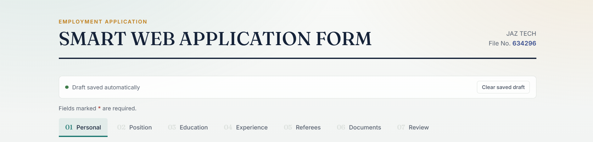
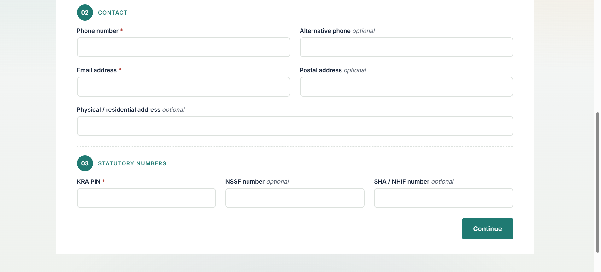
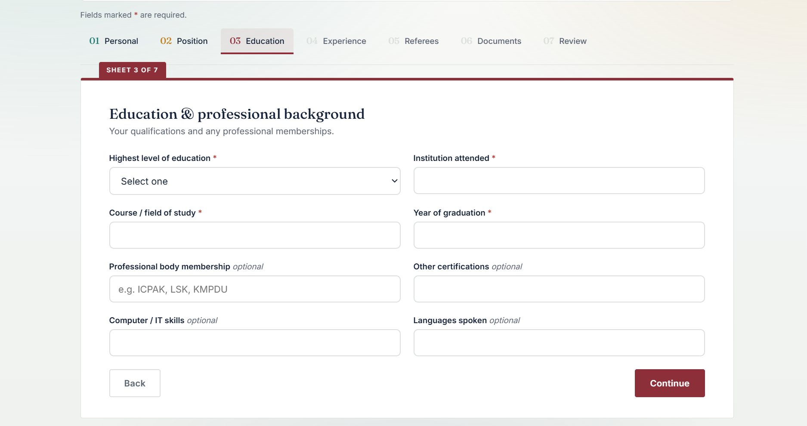
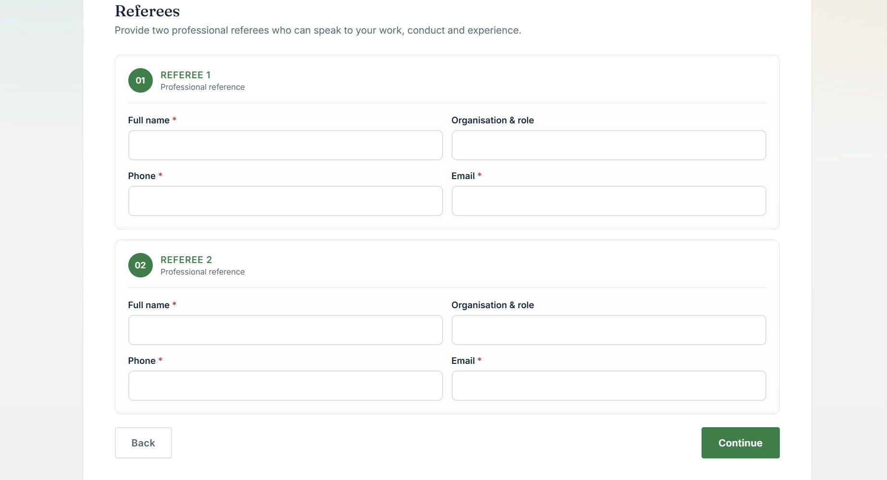
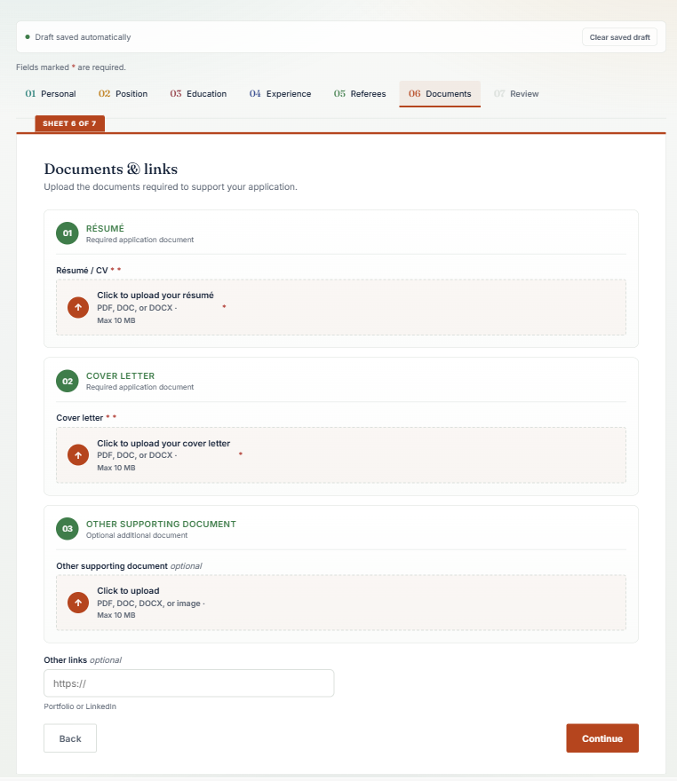
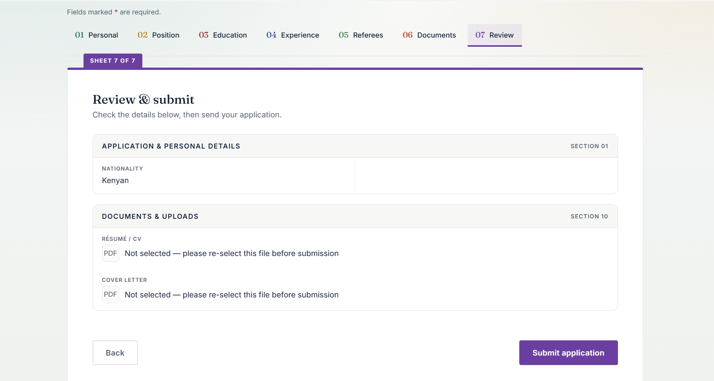

# JAZ TECH Online Job Application System

A professional web-based job application and recruitment system developed for **JAZ TECH** to streamline the collection, management, and processing of employment applications.

The system provides applicants with a structured, user-friendly application form where they can submit personal information, education, professional experience, referees, and required employment documents.


---

## 🌐 Project Overview

The JAZ TECH Online Job Application System replaces traditional paper-based job applications with a centralized digital application process.

Applicants can complete the application form online, upload their required documents, review their information before submission, and receive an application confirmation by email.

Submitted applications are automatically processed and stored using **Google Apps Script, Google Sheets, and Google Drive**.

---

## ✨ Key Features

### 📝 Comprehensive Application Form

The system collects:

- Personal information
- Contact information
- Identification details
- Nationality and county
- Postal and physical address
- KRA PIN
- NSSF number
- SHA number
- Position applied for
- Availability/notice period
- Current salary
- Expected salary
- Relocation preference
- Driving licence information
- How the applicant heard about the opportunity

---

### 🎓 Education & Professional Information

Applicants can provide:

- Highest education level
- Institution
- Course of study
- Graduation year
- Professional body
- Professional certifications
- IT skills
- Languages

---

### 💼 Employment & Experience

The system captures:

- Current employer
- Current job title
- Years of experience
- Reason for leaving
- Key responsibilities
- Applicant's motivation and suitability for the position

---

### 👥 Referee Management

The application includes two professionally structured referee sections.

Each referee can provide:

- Full name
- Organisation & role
- Phone number
- Email address

The information is displayed in a clean, structured format during the application review stage.


---

### 📄 Document Uploads

The system supports three document categories:

#### 01 — Résumé
**Required**

Applicants can upload:

- PDF
- DOC
- DOCX

Maximum file size: **10 MB**

#### 02 — Cover Letter
**Required**

Applicants can upload:

- PDF
- DOC
- DOCX

Maximum file size: **10 MB**

#### 03 — Other Supporting Document
**Optional**

Applicants may upload an additional supporting document such as:

- Certificates
- Professional documents
- Recommendation letters
- Other relevant supporting material

Maximum file size: **10 MB**


---

## 💾 Automatic Draft Saving

One of the major features of the system is automatic application draft saving.

Applicant information is automatically saved in the browser while the applicant completes the form.

If the applicant:

- Refreshes the page
- Accidentally closes the browser
- Returns to the application later

the previously entered information can be restored.

The system also remembers the section the applicant was working on.

### Important

For security reasons, browsers do not allow websites to automatically restore selected files from file-upload fields.

Therefore, uploaded documents may need to be selected again after a page refresh.

---

## 🔍 Application Review

Before submitting the application, applicants are presented with a structured review section.

The review organizes information into categories such as:

- Personal Information
- Contact Information
- Statutory Information
- Education
- Professional Qualifications
- Technical Skills
- Employment Experience
- Position Preferences
- Referees
- Documents

This allows applicants to verify their information before final submission.


---

## ☁️ Google Apps Script Backend

The system uses **Google Apps Script** as the backend.

When an application is submitted:

1. The form collects the applicant's information.
2. JavaScript validates the application.
3. Uploaded documents are converted into transferable data.
4. The application is sent to the Google Apps Script web application.
5. Google Apps Script processes the submission.
6. Uploaded documents are stored in Google Drive.
7. Application information is recorded in Google Sheets.
8. An email notification is sent to the administrator.
9. A confirmation email is sent to the applicant.

---

## 📊 Google Sheets Integration

Submitted applications are automatically recorded in a Google Sheets spreadsheet.

The spreadsheet contains structured columns for:

- Applicant information
- Contact details
- Education
- Employment history
- Skills
- Referees
- Position information
- Document links

This provides the recruitment team with a centralized application database.

---

## 📁 Google Drive Integration

Uploaded applicant documents are stored in a dedicated Google Drive folder.

The system preserves the original document format.

For example:

```text
Applicant Name — Resume.pdf
Applicant Name — Cover Letter.pdf
Applicant Name — Certificate.pdf
